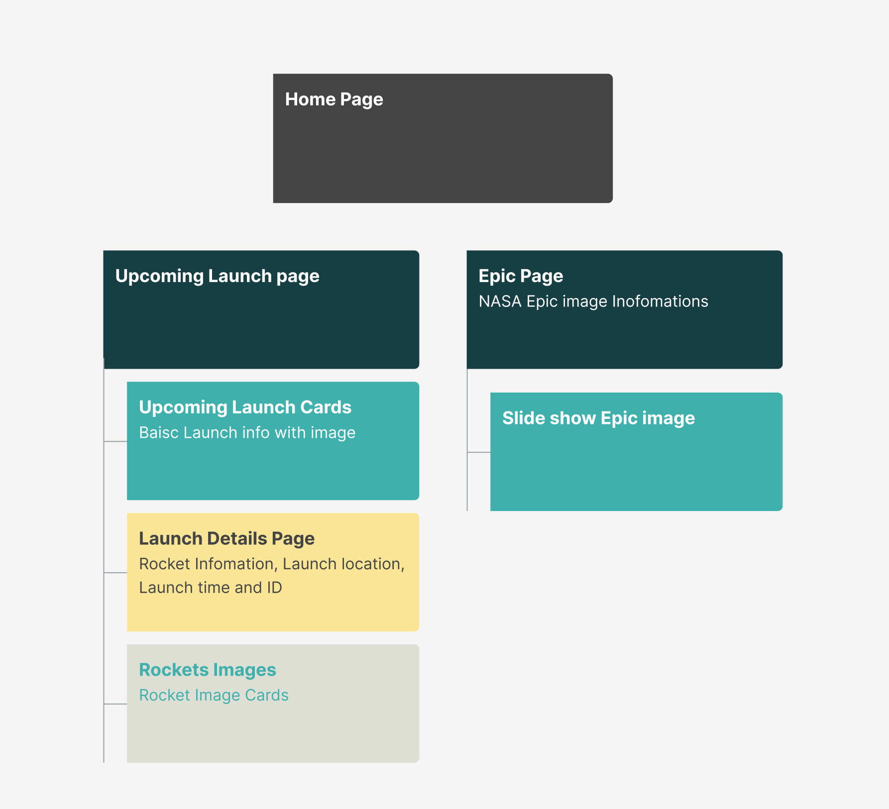
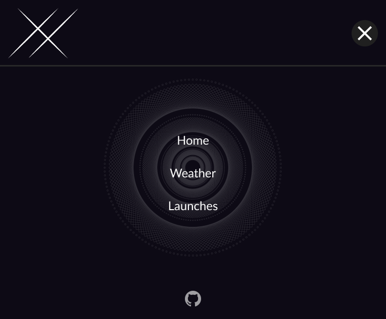

# Solar Conveyance

Our goal is to give you news about the events happening in our solar system. We'll tell you about the weather on mars and other weather phenomena in space. We'll also let you know about current space shuttle launches. We hope to give you a better appreciation for being apart of this beautiful universe of ours.

# APIs We Used

SPACEX:https://github.com/r-spacex/SpaceX-API/blob/master/docs/README.md
NASA:https://api.nasa.gov/

# Technology

# Languages

# Minimum Viable Product

1. Homepage that show a spectacular view of the Mars and our solar system.
2. Navbar with delicate slide-able animation with responsive design to multiple devices.
3. Upcoming launches page allow user to check recent launch events and check thier launch time.
4. Allow user to check each launch event details and regrading the rocket infomation and launch location information.
5. The EPIC Page provides information on the daily imagery collected by DSCOVR's Earth Polychromatic Imaging Camera instrument. And it provides full disc imagery of the Earth and captures unique perspectives of certain astronomical events.
6. A sophisticated interface that can be adapted to multiple screen sizes and 2 media queries.

# Post Minimum Viable Product

1. Implementation countdown clock on launch event details page.
2. Allow users to switch between light and dark theme mode.
3. Implementation watchlist feature of launch event, allow users can keep tracking of the launch details.

# Component Hierarchy

# Homepage (desktop/laptop view)

# Wireframes

 

